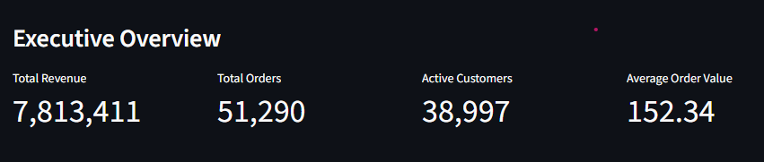
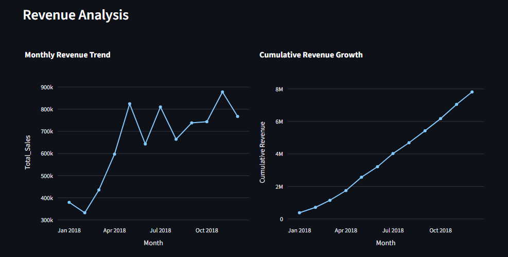
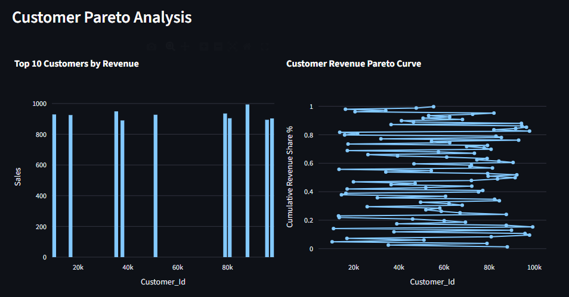
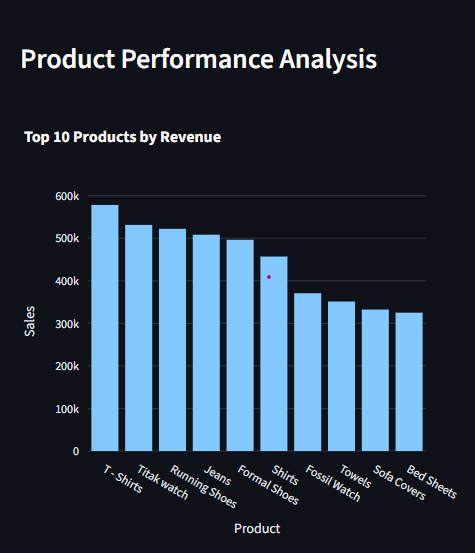

# E-Commerce Business Analytics Using Advanced SQL and Streamlit

[](https://e-commerce-business-analytics-using-advanced-sql-and-app-qefuh.streamlit.app)

---

## Project Overview

This project presents a comprehensive business analysis of an e-commerce dataset using advanced SQL techniques. The objective is to simulate real-world data analysis by transforming raw transactional data into actionable insights.

The analysis focuses on revenue performance, customer value, and product contribution, supported by an interactive Streamlit dashboard.

---

## Business Problem

E-commerce platforms generate large volumes of data but often lack clear insights into:

* Revenue growth patterns
* High-value customers
* Product contribution to total sales
* Revenue concentration

This project addresses these challenges using SQL-based analysis.

---

## Dataset Description

| Table         | Description                                                 |
| ------------- | ----------------------------------------------------------- |
| Orders        | Transaction-level data including customer, product, revenue |
| Customers     | Customer information                                        |
| Products      | Product catalog                                             |
| Categories    | Product categorization                                      |
| Monthly_Sales | Aggregated monthly revenue                                  |

---

## SQL Techniques Used

### Joins

```sql
SELECT *
FROM Orders o
JOIN Customers c ON o.CustomerID = c.CustomerID;
```

---

### Aggregations

```sql
SELECT CustomerID, SUM(TotalAmount) AS total_spent
FROM Orders
GROUP BY CustomerID;
```

---

### CTEs

```sql
WITH customer_revenue AS (
    SELECT CustomerID, SUM(TotalAmount) AS revenue
    FROM Orders
    GROUP BY CustomerID
)
SELECT * FROM customer_revenue;
```

---

### Window Functions

```sql
SELECT 
    CustomerID,
    SUM(TotalAmount) AS total_spent,
    RANK() OVER (ORDER BY SUM(TotalAmount) DESC) AS rank
FROM Orders
GROUP BY CustomerID;
```

---

### Pareto Analysis

```sql
SELECT 
    CustomerID,
    SUM(TotalAmount) AS revenue,
    SUM(SUM(TotalAmount)) OVER (ORDER BY SUM(TotalAmount) DESC) 
    / SUM(SUM(TotalAmount)) OVER () * 100 AS cumulative_share
FROM Orders
GROUP BY CustomerID;
```

---

## Dashboard Overview

The project includes an interactive dashboard that provides:

* Key performance indicators (Revenue, Orders, Customers, AOV)
* Revenue growth analysis
* Customer Pareto insights
* Product performance evaluation
* Data quality checks

---

## Dashboard Visuals

### Executive Overview

Provides a high-level summary of business performance using key metrics and revenue trends.



---

### Revenue Analysis

Displays revenue growth, cumulative performance, and monthly variation to understand business trends.



---

### Customer Pareto Analysis

Identifies revenue concentration by showing how a small percentage of customers contribute to total revenue.



---

### Product Performance

Highlights top-performing products and evaluates how revenue is distributed across products.



---

## Key Insights

* Revenue shows consistent growth with periodic fluctuations
* A small group of customers contributes the majority of revenue
* Product sales are concentrated among top-performing items
* Business performance can be improved through customer retention and product optimization


---

## Tools and Technologies

* SQL (core analysis)
* SQLite
* Python (Pandas)
* Streamlit
* Plotly

---

## How to Run

```bash
pip install -r requirements.txt
python -m streamlit run app.py
```

---

## Conclusion

This project demonstrates how SQL can be applied to real-world business scenarios to derive meaningful insights. It highlights the importance of understanding customer value, revenue concentration, and product performance for data-driven decision-making.

---
